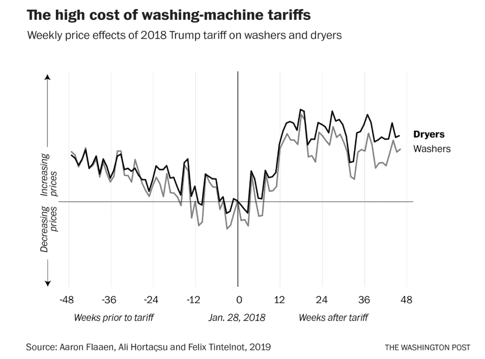
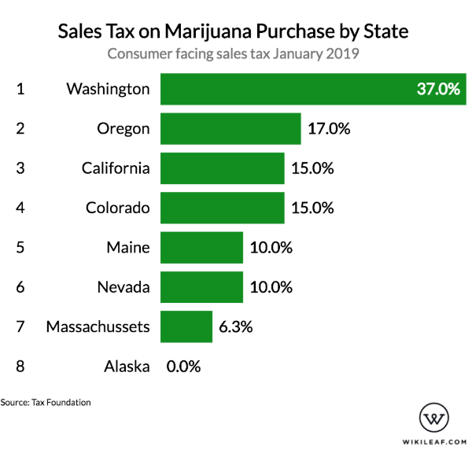
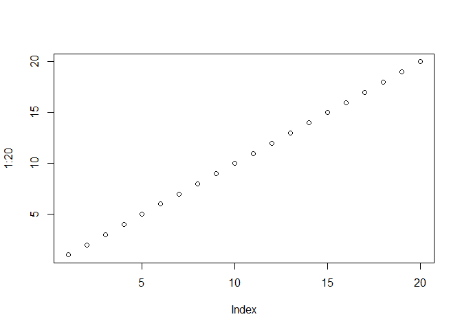

---  
title: "Case Study 1"  
author: "ashcraftc"  
date: "4/27/2019"
output:  
  html_document:  
    keep_md: true  
---  
    
    
#Data Visualization Reviews
    
##Visualization 1: Washing-Machine Prices

Full Article: [Washing Machine Tarriff Article](https://www.washingtonpost.com/us-policy/2019/04/23/trumps-washing-machine-tariffs-cost-us-consumers-every-job-created/?utm_term=.1ee02547673a).



####Strengths
* **Good Chart Type**: A line chart is very useful for showing changes over time and demonstrates very clearly how the price of washing-mashines fluctuates every few weeks or so.
* **Low Background Noise**: The vertical graph lines to show the twelve-week increments are very subtle and don't interfere at all with the plotted lines. There also isn't any unnecessary fluff creating additional noise.
* **Decent side-by-side comparison**: The two objects (washers and dryers) are both displayed fairly clearly on this chart with the difference in luminosity. However, it could be be even easier to differentiate between the two if there was also a difference in hue.

####Area that needs improvement
* **Y-axis**: The label on this y-axis confuses me about what the graph is trying to say. I first assumed that the points would be plotted by week and price during that week, but the label almost implies that the y factor is rate of change in price; the higher the point the faster the price is increases, the lower the point, the faster the price is decreasing. The y-axis should be labeled with actual price values to avoid confusion and also show whether I'm looking at a 75 cent change or a $75 change.  

##Visualization 2: American Science Smarts

Full Article: [Americans Are Smart About Science](https://fivethirtyeight.com/features/americans-are-smart-about-science/).


####Strengths
* **Ordering**: This chart did a good job of ordering each category from most correct answers to least correct answers. They even ordered the categories the same way.
* **Labeled Bars**: Labeling bars with whole statements isn't an easy task, but the horizontal bars with just enough space for a statement above makes it fairly easy to navigate. The numbers on the ends of the bars are also very helpful.
* **Left Alignment**: Left alignment is a small thing, but this graph would be much, much harder to read if these bars weren't lined up so well.

####Area that needs improvement
* **Emphasize Extremes**: It takes me a little bit of time to find the questions that got the most wrong answers. It would be a good idea to change the hue of these bars to red or something to see what they want me to see more quickly.

##Visualization 3: Recreational Mirajuana Tax
    
Full Article: [Taxes on Recreational Marijuana](https://priceonomics.com/which-states-have-highest-taxes-on-marijuana/).



####Strengths
* **Ordering**: The ordering from highest to lowest makes it very easy to navigate.
* **Ranking**: The ranking on the left side complements the ordering and provides a second way to reference each state.
* **No Background Noise**: WHile one could argue that the ranking is unnecessary, there is absolutely nothing interfering with the colors, words, or numbers in the chart, which makes it very easy to read.

####Area that needs improvement
* **Graph Type**: The message being communicated with this chart is so simple that one might ask if it would be just as effective to show a ranked table. Given that there are only 8 states included, the bars in this chart don't really give any additional information.

##Visualization 4: Suicide Rates for Major Professions

Full Article: [Suicide Rates for Major Professions](https://priceonomics.com/the-professions-with-highest-and-lowest-suicide/).


####Strengths
* **Ordering**: The ordering from highest to lowest suicide rate is very easy to navigate.
* **Alternating Gray and White Lines**: These lines contrast enough to help guide the eye horizontally across the 4 columns of information but are subtle enough to not interfere with the information itself.
* **Helpful Subtitle**: This subtitle clarifies the units of measurement that they're using and eliminates the need to have a long column heading.

####Area that needs improvement
* **Graph Type**: The bars aren't really showing anything. Plus, it makes the 52.1 at the top seem much higher than it really is in relation to the 100,000. I would suggest eliminating the bars altogether.

##Thank You for Reading!

I also included this plot for no apparent reason. Enjoy!
    

```r
plot(1:20)
```

<!-- -->
    
    
